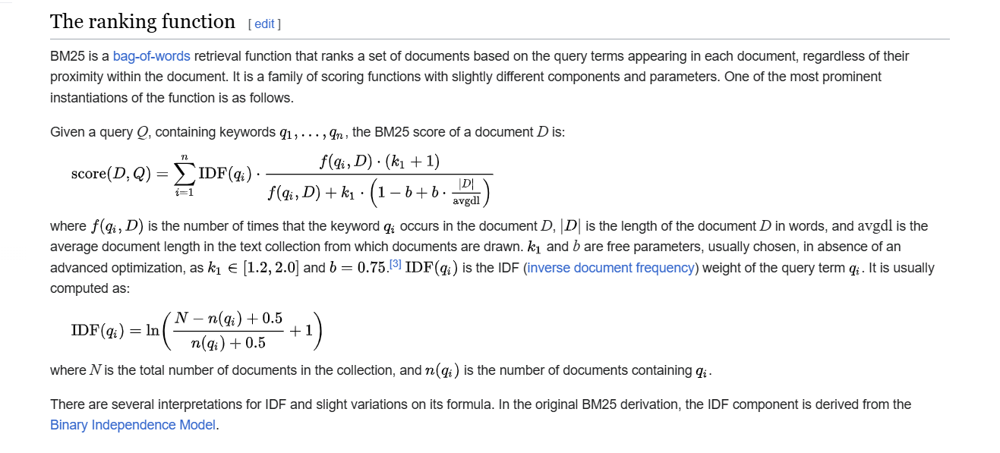

# Search Engine
    Using BM25 with Node.js in a Web Development Application.
    The BM25 algorithm, a probabilistic information retrieval model, is widely used for ranking documents based on their relevance to a given query. This guide will show you how to implement BM25 in a Node.js web development application.
# Rank-BM25:

A collection of algorithms for querying a set of documents and returning the ones most relevant to the query. The most common use case for these algorithms is, as you might have guessed, to create search engines.

These algorithms were taken from [this paper](http://www.cs.otago.ac.nz/homepages/andrew/papers/2014-2.pdf), which gives a nice overview of each method, and also benchmarks them against each other. A nice inclusion is that they compare different kinds of preprocessing like stemming vs no-stemming, stopword removal or not, etc. Great read if you're new to the topic.



# How BM25 Works

BM25 scoring function considers the following factors:

- **Term Frequency (TF)**: The frequency of a term within a document.
- **Inverse Document Frequency (IDF)**: The logarithmically scaled inverse fraction of the documents that contain the term.
- **Document Length Normalization**: Adjusts the term frequency based on the length of the document.

The formula for BM25 is as follows:

\[
\text{score}(D, Q) = \sum\_{t \in Q} \text{IDF}(t) \cdot \frac{f(t, D) \cdot (k_1 + 1)}{f(t, D) + k_1 \cdot (1 - b + b \cdot \frac{|D|}{\text{avg}|D|})}
\]

Where:

- \( t \) is a term in the query \( Q \).
- \( f(t, D) \) is the term frequency of \( t \) in document \( D \).
- \( |D| \) is the length of document \( D \).
- \( \text{avg}|D| \) is the average document length in the corpus.
- \( k_1 \) and \( b \) are hyperparameters. Typical values are \( k_1 = 1.5 \) and \( b = 0.75 \).
- \( \text{IDF}(t) \) is the inverse document frequency of the term \( t \).

## Prerequisites

1. **Node.js**: Ensure you have Node.js installed. You can download it from [nodejs.org](https://nodejs.org/).
2. **Express**: A minimal and flexible Node.js web application framework.
3. **BM25 Library**: A BM25 implementation in JavaScript.

## Installation (Initialize a new Node.js project)

The easiest way to install this package is through `pip`, using
```sh
   mkdir bm25-webapp
   cd bm25-webapp
   npm init -y
```

## Usage

we'll be using the `BM25` algorithm

### Initalizing

First thing to do is create an instance of the BM25 class, which reads in a corpus of text and does some indexing on it:

```
const express = require('express');
const { buildBM25, rankDocuments } = require('./bm25');

const bm25 = buildBM25(documents);

app.use(express.static('public'));
app.use(express.json());

app.post('/search', (req, res) => {
    const query = req.body.query;
    const results = rankDocuments(bm25, query);
    res.json(results);
});
```

```
const app = express();
const port = 3000;

const documents = [
    "The quick brown fox jumps over the lazy dog",
    "The fox",
    "The dog",
    "A quick brown dog outpaces a quick fox"
];

const tokenize = text => text.toLowerCase().split(/\W+/);

const buildBM25 = documents => {
    const tokenizedDocs = documents.map(tokenize);
    return new BM25(tokenizedDocs);
};
```

```
async function search() {
    const query = document.getElementById('query').value;
    const response = await fetch('/search', {
        method: 'POST',
        headers: {
            'Content-Type': 'application/json'
        },
        body: JSON.stringify({ query })
    });
    const results = await response.json();
    const resultsList = document.getElementById('results');
    resultsList.innerHTML = '';
    results.forEach(result => {
        const li = document.createElement('li');
        li.textContent = result;
        resultsList.appendChild(li);
    });
}
```

Note that this package doesn't do any text preprocessing. If you want to do things like lowercasing, stopword removal, stemming, etc, you need to do it yourself.

The only requirements is that the class receives a list of lists of strings, which are the document tokens.

### Ranking of documents

Now that we've created our document indexes, we can give it queries and see which documents are the most relevant:

```
const rankDocuments = (bm25, query) => {
    const tokenizedQuery = tokenize(query);
    return bm25.search(tokenizedQuery);
};
```

Good to note that we also need to tokenize our query, and apply the same preprocessing steps we did to the documents in order to have an apples-to-apples comparison

Instead of getting the document scores, you can also just retrieve the best documents with

```python
bm25.get_top_n(tokenized_query, corpus, n=1)
# ['It is quite windy in London']
```

#### Resources

https://en.wikipedia.org/wiki/Okapi_BM25
