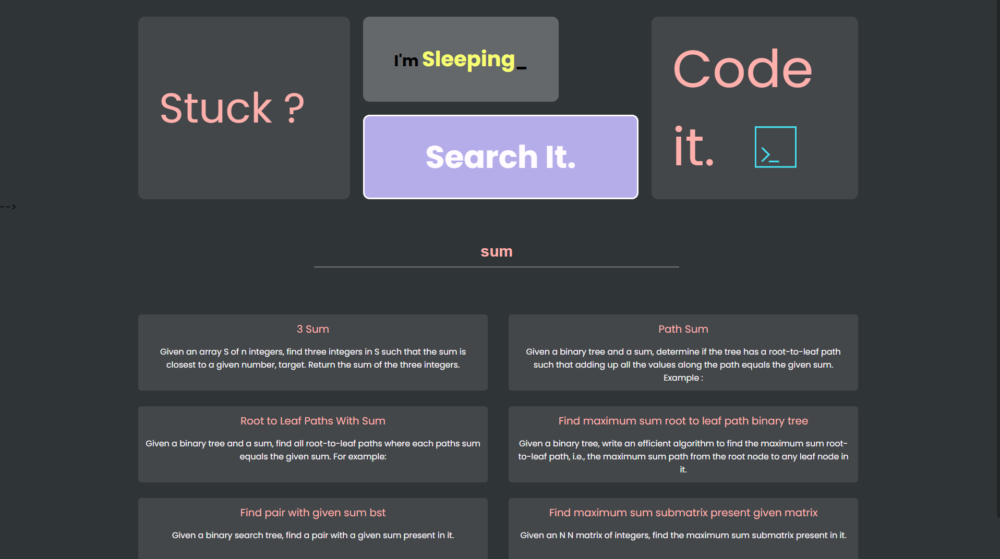

# <u>**_CodeQuest_**</u> <a href="https://codequest-jalp.onrender.com/" style="font-size:smaller;">(visit)</a>

## Project Description: Document Search Engine

## <u>Overview:</u>

The Document Search Engine is a web application designed to facilitate efficient searching and retrieval of information from a collection of documents. It utilizes various natural language processing techniques to preprocess the documents, extract keywords, calculate term frequencies, and generate relevant search results based on user queries.

## <u>Key Features:</u>

- <b>Document Preprocessing:</b>

  - Removes stopwords and punctuation from the documents.
  - Tokenizes and normalizes the text to extract meaningful keywords.

- <b>Keyword Generation:</b>

  - Generates a unique set of keywords from the document corpus.
  - Organizes keywords for efficient indexing and searching.

- <b>Term Frequency Calculation:</b>

  - Calculates the term frequency (TF) of each keyword within each document.
  - Measures the frequency of occurrence of keywords to determine their significance.

- <b>Inverse Document Frequency Calculation:</b>

  - Computes the inverse document frequency (IDF) of each keyword across the document corpus.
  - Determines the importance of keywords based on their rarity across documents.

- <b>TF-IDF Vectorization:</b>

  - Combines TF and IDF to calculate the TF-IDF (Term Frequency-Inverse Document Frequency) vector for each document.
  - Represents documents as vectors to quantify their relevance to search queries.

- <b>Search Engine Functionality:</b>
  - Processes user queries and matches them against the indexed documents. - Ranks search results based on TF-IDF similarity and other relevance metrics.
  - Provides relevant document snippets and links for user exploration.

## <u>Technologies Used:</u>

- <b>Node.js and Express.js:</b> Backend framework for handling HTTP requests, routing, and server-side logic.

- <b>JavaScript (ES6+):</b> Programming language for implementing server-side and client-side functionalities.

- <b>Natural Language Processing (NLP) Libraries:</b>
  - stopword: Removes stopwords (common words) from documents.
  - remove-punctuation: Eliminates punctuation marks from text.
  - wink-lemmatizer: Lemmatizes words to their base form for better analysis.
  - number-to-words and words-to-numbers: Convert numbers to words and vice versa for enhanced query processing.
  - natural: Library for natural language processing tasks such as tokenization and lemmatization.
  - string-similarity: Computes string similarity metrics for search and matching purposes.
  - simple-spellchecker: Provides spell checking functionality for text processing tasks.

These dependencies enhance the capabilities of the Document Search Engine by providing additional functionality for text processing, spell checking, string similarity comparison, and validation tasks.

- <b>Data Storage:</b>

  - File System (fs): Manages reading and writing documents and intermediate results.

- <b>Web Development:</b>

  - Express EJS: Templating engine for rendering dynamic HTML content on the server side.
  - HTML5 and CSS3: Frontend markup and styling for the user interface.

- <b>Dependency Management:</b>

  - npm (Node Package Manager): Manages project dependencies and scripts for development and production environments.

## <u>Workflow:</u>

- <b>Document Processing:</b>

  - Documents are preprocessed to extract meaningful keywords and remove noise.
  - Preprocessing involves tokenization, stopword removal, punctuation removal, and lemmatization.

- <b>Indexing:</b>

  - Keywords are indexed and stored for efficient retrieval during search operations.
  - Term frequencies (TF) and inverse document frequencies (IDF) are calculated and stored for each keyword.

- <b>Search Operations:</b>

  - User queries are processed and matched against the indexed keywords.
  - Relevant documents are retrieved based on TF-IDF similarity and other ranking criteria.
  - Search results are presented to the user along with document snippets and links for further exploration.

- <b>User Interface:</b>
  - The web application provides a user-friendly interface for querying and browsing documents.
  - Search results are displayed in a clear and organized manner, facilitating easy navigation and exploration.

## <u>Dependencies:</u>

**_express:_** Web framework for Node.js.
**_ejs:_** Templating engine for generating dynamic HTML content.
**_stopword:_** Library for removing stopwords from text.
**_remove-punctuation:_** Utility for removing punctuation marks from strings.
**_wink-lemmatizer:_** Tool for lemmatizing words to their base form.
**_number-to-words and words-to-numbers:_** Modules for converting numbers to words and vice versa.

## <u>Conclusion:</u>

The Document Search Engine project aims to enhance document retrieval and exploration by leveraging natural language processing techniques and advanced indexing algorithms. It provides users with a powerful and intuitive tool for searching, analyzing, and extracting insights from large document collections. With its robust functionality and user-friendly interface, the application serves as a valuable resource for researchers, students, and professionals seeking to efficiently access and navigate textual information.
